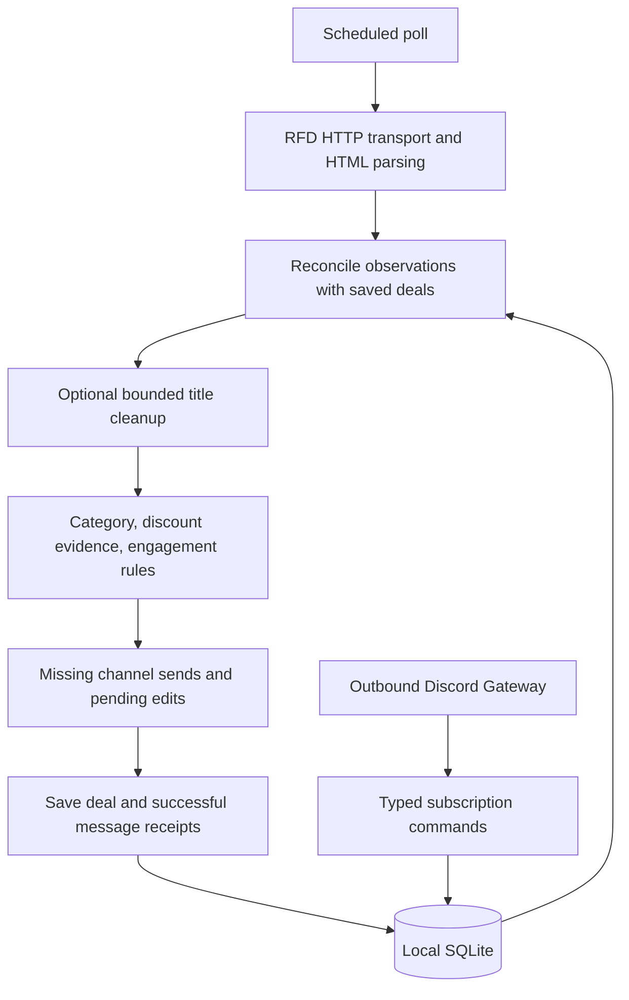

# Architecture and rewrite decisions

The bot exists to help people sift through RedFlagDeals: discover threads, group
reposts, apply understandable filters, and keep useful Discord alerts current.
The September 2026 rewrite keeps that purpose and the existing commands.

## Language decision

**Keep Go.** The audit found tangled responsibilities and inherited features,
not a need for a different runtime. Before the rewrite, the project had 6,857
lines of production Go and 6,991 lines of Go tests. The most concentrated code
was the processor (1,460 lines), scraper (1,161), and optional Gemini wrapper
(1,137). Tests are counted separately; deleting regression coverage would not
make the service simpler to maintain.

These are engineering judgments for this application, not language benchmarks:

| Choice | Fit for this bot | Decision |
| --- | --- | --- |
| Go | Existing HTTP, Discord Gateway, SQLite adapters; a single native executable; explicit cancellation and race checking | Keep it, simplify the application structure |
| Python | A credible option for concise scraping and Discord code; requires preserving the same async, delivery, and database contracts | Best alternative if future maintainers strongly prefer Python; no demonstrated benefit large enough to justify porting now |
| Rust | Strong type and memory guarantees; still needs the same network state machines and delivery bookkeeping | No measured CPU or memory problem that calls for this migration |
| OCaml | Good algebraic data types and functional domain modeling | Could express the rules well; porting the integration surface is extra work without an identified requirement |
| Gleam | Typed functional code with Erlang/BEAM concurrency or JavaScript output | Its runtime strengths do not remove this bot's persistence and remote API constraints |
| F# | Concise functional modeling with .NET libraries | Reasonable for a .NET maintainer; introducing another runtime offers no demonstrated advantage here |

Relevant primary references: [Go's small interfaces](https://go.dev/doc/effective_go#interfaces),
[discord.py](https://discordpy.readthedocs.io/en/stable/intro.html),
[Rust ownership](https://doc.rust-lang.org/book/ch04-00-understanding-ownership.html),
[OCaml](https://ocaml.org/about), [Gleam](https://gleam.run/), and
[F#](https://learn.microsoft.com/en-us/dotnet/fsharp/what-is-fsharp).

The core workflow, title-cleaning client, and delivery/command boundaries were
rewritten. Proven HTML selectors, URL normalization, deduplication rules, and
migration validation were retained where their behavior was already useful.
Replacing every line would add verification work without fixing another problem.

## Measured code size

Physical lines of Go, measured from `907ebc8` and this rewrite; generated files,
Python setup helpers, fixtures, and documentation are excluded. Moving a function
between files does not count as a reduction.

| Scope | Before | After |
| --- | ---: | ---: |
| Production Go | 6,857 | 5,744 |
| Go tests | 6,991 | 7,152 |
| Gemini adapter | 1,137 | 426 |
| Processor including deduplication | 1,460 | 1,278 |

Production code is about 16% smaller. Test line counts describe size, not coverage;
obsolete tests for removed features were replaced with behavioral regressions.

## One service, explicit boundaries

| Code | Responsibility |
| --- | --- |
| `cmd/rfd` | Configuration, lifetime, polling, health, registration, offline import |
| `internal/scraper/transport.go` | HTTP, allowed hosts, cookies, RFD proof-of-work response |
| `internal/scraper/parse.go` | HTML and JSON-LD extraction; detail parser accepts a document |
| `internal/scraper/scraper.go` | Fetch orchestration, bounded detail concurrency, retries |
| `internal/processor/source.go` | Validate observations, load matching history, reuse/fetch details |
| `internal/processor/reconcile.go` | Detached deal reconciliation and thread merging |
| `internal/processor/dedupe.go` | Existing thread/product/token matching rules |
| `internal/processor/titles.go` | Poll-local batches of ten, canonical deal mapping, 30-second cleanup budget |
| `internal/processor/processor.go` | Poll stages, per-channel delivery reconciliation, immediate per-deal persistence |
| `internal/dealquality` and `internal/dealtypes` | Pure engagement/discount rules and six subscription filters |
| `internal/notifier/render.go` | Discord message presentation |
| `internal/notifier/client.go` | HTTP delivery, rate limits, receipts, retry nonces, application ownership |
| `internal/api` | Typed command handling and Gateway transport |
| `internal/ai` | Optional Gemini title cleanup and persisted quota fallback |
| `internal/storage` | SQLite operations, schema validation, application binding, offline migration |

The processor no longer asks Discord transport to decide whether a deal is warm
or hot. Both filtering and presentation use the same pure engagement functions.
Title queues cannot survive a poll. Reconciliation copies maps and slices before
changing a deal, so failed processing cannot mutate the storage snapshot in memory.

The service does not need a broker, Redis, Postgres, a web framework, another bot,
or a microservice for each stage. New abstractions should answer a concrete need.

## Database decision

**Keep SQLite and the existing on-disk format.** This is one process with modest
local state, which fits [SQLite's intended application storage use](https://www.sqlite.org/whentouse.html).
The store uses WAL, a single SQL connection, bounded transactions, and parameterized
queries. Batched ID reads now issue bounded `IN` queries instead of one query per
scraped deal.

There are three tables: `deals`, `subscriptions`, and `settings`. The deal's JSON
payload is an aggregate containing source details, grouped threads, and message
receipts; indexed columns support history and retention. The application reads
whole deals, so keeping this aggregate avoids joins and a disruptive migration.
Strict schema checks reject another bot's database. Application binding prevents
using this history with an unintended Discord application.

Exported model field names remain unchanged. Old `docstore` tags were unused by
SQLite's JSON encoding and have been removed. Historical fields remain readable
by the strict migration decoder. This rewrite requires no database conversion.

A normalized delivery table would become useful for multiple workers, durable
scheduled delivery outside the observed feed, or independently tracking edit
acknowledgements for many channels. Those are explicit future features, not a
reason to add a database server now.

## Reliability corrections

- Description and summary evidence survive title cleanup. Cleaning a title must
  not remove the source evidence used by the discount filter.
- Missing channel receipts are reconciled on every observed poll, including
  unchanged deals and newly added subscriptions.
- Discord delivery returns successful receipts alongside channel errors. Partial
  success is saved and only missing channels are retried.
- Each changed deal is saved before processing the next. A storage write failure
  stops further delivery. Cancellation after a send gets a bounded five-second
  opportunity to save its receipt.
- Changed content waiting for the edit interval stays pending across polls.
  Unchanged messages are not repeatedly edited simply because time passed.
- History/subscription read failures stop the poll instead of treating missing
  state as an empty database.
- Overlong raw or cleaned titles are shortened only when rendering the Discord
  card, including Unicode and the hot-deal suffix. Stored titles are preserved.
- Actual Gemini requests, retries, parsing failures, tokens, and successful
  channel sends are counted. Cooldown skips are not reported as network requests.
- An explicit `SELECTORS_CONFIG_PATH` now takes precedence and fails visibly if
  invalid. The embedded JSON is the single default selector definition.

Removed inherited features include unused Vertex/grounding/general generation
APIs, image upload machinery that no RFD message used, unrelated bot metrics,
Cloud-specific logging plumbing, and the generic validation dependency. The
Gemini SDK remains behind the focused title-cleaner adapter; its version is
explicit in `go.mod` and was not silently upgraded.

## Compatibility and limits

The six filters, category/discount/engagement thresholds, title-only AI role,
command names, management permissions, private replies, outbound Gateway,
application checks, imported message ownership, offline import, Docker volume,
and health endpoints remain supported. Other bots and reverse proxy configuration
are outside this repository.

Message delivery is not an exactly-once transaction with Discord. A stable nonce
scoped to application/channel/deal suppresses ambiguous retries within Discord's
[recent nonce window](https://docs.discord.com/developers/resources/message#create-message); persisted receipts suppress later repeats. A crash after a
successful POST and before SQLite saves, followed by a long outage, can still
produce a duplicate. The original application had a wider crash window covering
the entire poll. A local outbox alone cannot make a remote HTTP side effect
atomically commit with SQLite.

Other deliberate limits remain:

- Existing document IDs are hashes of publication timestamps. Changing identity
  would require an explicit alias migration; two different posts with identical
  timestamps remain a known collision risk.
- Fuzzy duplicate matching and phrase-based discount evidence are heuristics.
  Warm/hot is a filter, not a guarantee of value. Their thresholds were not retuned.
- Failed sends are retried while a deal remains observed in the feed. This is not
  an indefinite historical alert queue.
- The existing global edit acknowledgement may retry an already successful edit
  when a different owned channel fails; it does not silently acknowledge failures.
- Source changes, remote limits, and unavailable AI models can still fail. Tests
  cannot establish live provider availability.

## Validation and rollout

Run `go test -race -tags=integration ./...`, `go vet ./...`, and the Python
credential-helper tests. All automated verification uses disposable SQLite and
local HTTP/WebSocket fixtures, including the complete scrape-to-Discord pipeline,
restart deduplication, imported ownership, quota persistence, partial sends,
pending edits, cancellation, corrupt history, and selector overrides.

Build the canonical Dockerfile and run `check-config` and `check-storage` with
fixture credentials and a disposable volume under `--network none`. The scratch
image runs as UID/GID 65532. Tests must never mount production data or send to real
Discord channels.

The rewrite is developed on `codex/rfd-architecture-rewrite` for review. Deploy it
by building its image, stopping the existing standalone process, taking a
consistent database backup, selecting the new image, and starting that one
process on the same volume and application. Verify ordinary scheduled polls and
Gateway health. Rollback selects the old image while retaining the current data;
do not overwrite newer history with an old backup. Never run both producers on
the same Discord application.
