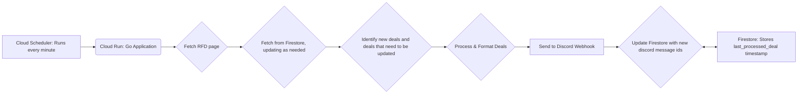

# RFD Hot Deals Discord Bot

TLDR; Watches RFD hot deals forum, runs on google cloud, posts to discord.

## Features

*   Identifies RFD Hot Deals using Firestore for state management.
*   Sends notifications to a configurable Discord webhook.
*   Designed for lightweight, serverless deployment on Google Cloud Run (free tier).

## Simplified Architecture

The bot operates with a simple, serverless architecture on Google Cloud:

*   **Cloud Scheduler:** Triggers the bot every minute (or as configured).
*   **Cloud Run:** Hosts the Go application. When triggered, it:
    1.  Fetches the latest deals from the RFD Hot Deals.
    2.  Checks Firestore to determine if the deal is fresh, updating as needed.
    3.  Processes new deals (extracts info, filters, formats) or prepares to update likes/views/comments if it's an old deal.
    4.  Sends formatted deal notifications to the configured Discord webhook and updates firestore with the returned message id.
*   **Firestore:** Stores the deal data and state, ensuring deals are not sent multiple times.



## Local Development

### Clone Repository

```bash
git clone https://your-repository-url/rfd-discord-bot.git
cd rfd-discord-bot
```
*(Replace `https://your-repository-url/rfd-discord-bot.git` with the actual URL of your repository)*

### Environment Setup (Go)

1.  **Install Go:** Download and install Go from the [official Go download page](https://golang.org/dl/).
2.  **Navigate to Directory:** Open your terminal and navigate to the cloned `rfd-discord-bot` directory.
    ```bash
    cd path/to/rfd-discord-bot
    ```
3.  **Install Dependencies:** Run the following command to download and install the necessary Go modules:
    ```bash
    go mod tidy
    ```

### Environment Variables for Local Testing

The application requires the following environment variables to run locally:

*   `GOOGLE_CLOUD_PROJECT`: Your Google Cloud Project ID.
*   `DISCORD_WEBHOOK_URL`: The Discord webhook URL where notifications will be sent.

It's recommended to create a `.env` file in the project root to store these variables. This file is included in `.gitignore` to prevent accidental commits of sensitive information.

**Create `.env` file:**
```bash
# .env
export GOOGLE_CLOUD_PROJECT="your-gcp-project-id"
export DISCORD_WEBHOOK_URL="your-discord-webhook-url"
```
Replace `"your-gcp-project-id"` and `"your-discord-webhook-url"` with your actual values.

**Load Environment Variables:**
Before running the application, source the `.env` file:
```bash
source .env
```
Alternatively, you can set these variables directly in your shell session:
```bash
export GOOGLE_CLOUD_PROJECT="your-gcp-project-id"
export DISCORD_WEBHOOK_URL="your-discord-webhook-url"
```

### Running Locally

Once the environment variables are set, you can run the application using:
```bash
go run main.go
```
Or, if all your Go files are in the `main` package and in the root directory:
```bash
go run .
```
This will start an HTTP server, typically on port `8080` (or the port specified by the `PORT` environment variable, which Cloud Run sets automatically).

To test the handler locally, you can send a GET request to `http://localhost:8080/` (or the specific path your handler listens on, if different) using a tool like `curl` or your web browser.
```bash
curl http://localhost:8080/
```
Note: While you can trigger it via HTTP locally, in the deployed Google Cloud environment, the primary trigger is Cloud Scheduler.

## Google Cloud Deployment (Detailed & Hand-holding)

These instructions will guide you through deploying the bot to Google Cloud Run.

### Prerequisites

1.  **Google Cloud Project:** You need an active Google Cloud Project. If you don't have one, create one at the [Google Cloud Console](https://console.cloud.google.com/).
2.  **`gcloud` CLI:** Install and initialize the Google Cloud CLI.
    *   Installation instructions: [Google Cloud SDK](https://cloud.google.com/sdk/docs/install)
    *   Authenticate and initialize `gcloud`:
        ```bash
        gcloud auth login
        gcloud init
        ```
        During `gcloud init`, you will be prompted to pick a project and can set a default region. This is the recommended first step.

    *   **Set Environment Variables for `gcloud` commands:**
        For convenience, and to avoid repeatedly typing your project ID and region, set the following environment variables in your shell. These will be used in subsequent `gcloud` commands.

        **For Linux/macOS (bash/zsh):**
        ```bash
        export PROJECT_ID=$(gcloud config get-value project)
        export REGION="us-central1" # Or your preferred region, e.g., us-east1, europe-west1
        echo "PROJECT_ID set to: $PROJECT_ID"
        echo "REGION set to: $REGION (Ensure this is a valid region for your services and that it supports Cloud Run, Firestore, and Cloud Scheduler)"
        ```

        **For Windows (Command Prompt):**
        ```bash
        for /f "tokens=*" %i in ('gcloud config get-value project') do set PROJECT_ID_VAL=%i
        set REGION_VAL=us-central1
        echo PROJECT_ID_VAL is set to: %PROJECT_ID_VAL%
        echo REGION_VAL is set to: %REGION_VAL% (Ensure this is a valid region for your services)
        ```
        Then use `%PROJECT_ID_VAL%` and `%REGION_VAL%` in the `gcloud` commands where indicated.

        **For Windows (PowerShell):**
        ```powershell
        $env:PROJECT_ID = $(gcloud config get-value project)
        $env:REGION = "us-central1" # Or your preferred region
        Write-Host "PROJECT_ID set to: $env:PROJECT_ID"
        Write-Host "REGION set to: $env:REGION (Ensure this is a valid region for your services)"
        ```
        Then use `$env:PROJECT_ID` and `$env:REGION` in the `gcloud` commands where indicated.

        **Note on Region Selection:**
        While `us-central1` is suggested as a common, cost-effective default, it's crucial to:
        1.  Verify that your chosen region supports all necessary services (Cloud Run, Firestore, Cloud Scheduler).
        2.  Consider factors like latency to your users or the source of data (e.g., RFD servers).
        3.  Check current pricing for services in that region.
        You can list available compute regions using `gcloud compute regions list`. The region for Firestore is chosen during its setup and should ideally match your Cloud Run and Cloud Scheduler region.

### Enable APIs

The bot requires several Google Cloud APIs to be enabled for your project:
*   Cloud Run API: For deploying and running the serverless application.
*   Cloud Firestore API: For database storage.
*   Cloud Scheduler API: For triggering the bot periodically.
*   Cloud Build API: For building container images when deploying from source.

Enable them using the following `gcloud` command:
```bash
# For Linux/macOS (ensure PROJECT_ID is set as shown above):
gcloud services enable run.googleapis.com firestore.googleapis.com cloudscheduler.googleapis.com cloudbuild.googleapis.com --project "$PROJECT_ID"

# For Windows CMD (ensure PROJECT_ID_VAL is set):
# gcloud services enable run.googleapis.com firestore.googleapis.com cloudscheduler.googleapis.com cloudbuild.googleapis.com --project "%PROJECT_ID_VAL%"

# For PowerShell (ensure $env:PROJECT_ID is set):
# gcloud services enable run.googleapis.com firestore.googleapis.com cloudscheduler.googleapis.com cloudbuild.googleapis.com --project "$env:PROJECT_ID"
```
Ensure you use the correct variable (`$PROJECT_ID`, `%PROJECT_ID_VAL%`, or `$env:PROJECT_ID`) based on your shell and the setup instructions above.

### Configure Cloud Build Service Account Permissions

When deploying to Cloud Run from source (using the `--source .` flag), Google Cloud Build is utilized to build your container image and push it to Artifact Registry. The Cloud Build service account requires specific IAM permissions to perform these actions. If these permissions are missing, the deployment will likely fail with a `PERMISSION_DENIED` error during the build process.

**1. Identify Your Project Number:**
You'll need your Google Cloud Project Number (distinct from the Project ID) to correctly identify the Cloud Build service account. You can retrieve it using the following command:
```bash
# For Linux/macOS:
gcloud projects describe "$PROJECT_ID" --format='value(projectNumber)'

# For Windows CMD:
# gcloud projects describe "%PROJECT_ID_VAL%" --format='value(projectNumber)'

# For PowerShell:
# gcloud projects describe "$env:PROJECT_ID" --format='value(projectNumber)'
```
Make a note of the outputted project number (e.g., `123456789012`), as you'll need it in the next step.

**2. Grant `roles/run.builder` to the Cloud Build Service Account:**
The Cloud Build service account, which typically has an email address like `YOUR_PROJECT_NUMBER@cloudbuild.gserviceaccount.com`, needs the `roles/run.builder` role on your project to successfully build and deploy to Cloud Run. Grant this role using the command below, ensuring you replace `YOUR_PROJECT_ID` and `YOUR_PROJECT_NUMBER` (the value obtained in the previous step):
```bash
# For Linux/macOS (replace YOUR_PROJECT_NUMBER with the value from the previous step):
gcloud projects add-iam-policy-binding "$PROJECT_ID" --member="serviceAccount:YOUR_PROJECT_NUMBER@cloudbuild.gserviceaccount.com" --role="roles/run.builder"

# For Windows CMD (replace YOUR_PROJECT_NUMBER):
# gcloud projects add-iam-policy-binding "%PROJECT_ID_VAL%" --member="serviceAccount:YOUR_PROJECT_NUMBER@cloudbuild.gserviceaccount.com" --role="roles/run.builder"

# For PowerShell (replace YOUR_PROJECT_NUMBER):
# gcloud projects add-iam-policy-binding "$env:PROJECT_ID" --member="serviceAccount:YOUR_PROJECT_NUMBER@cloudbuild.gserviceaccount.com" --role="roles/run.builder"
```
This step is crucial for deployments from source to succeed.

**Artifact Registry Note:**
Additionally, when deploying from source for the first time, `gcloud run deploy` might prompt you to enable the Artifact Registry API (`artifactregistry.googleapis.com`) and offer to create a default Docker repository (e.g., `cloud-run-source-deploy`) in your chosen region. You should allow these operations when prompted, as Artifact Registry is used to store the container images built by Cloud Build.

### Create Firestore Instance

To set up Firestore for the bot, follow these steps in the [Google Cloud Console](https://console.cloud.google.com/firestore):

1.  **Navigate to Firestore:** Go to the Firestore section of the Google Cloud Console.
2.  **Create Database:** If you don't have a Firestore database in your project, click **"Create Database"**.
3.  **Select Database ID:**
    *   You'll be prompted to name your database (Database ID).
    *   **Recommendation:** Use the default ID, which is typically `(default)`.
    *   *Justification:* The application code ([`firestore_client.go`](firestore_client.go:1)) is configured to use the default database and does not specify a custom ID.
4.  **Choose Edition:**
    *   Select the **"Standard"** edition.
    *   *Justification:* This edition is cost-effective for applications with minimal data and low-frequency operations, suitable for this bot.
5.  **Select Mode:**
    *   Choose **"Native Mode"**.
    *   *Justification:* This is required by the Go client library used in the application and aligns with existing project documentation.
6.  **Set Up Security Rules:**
    *   You will be asked to configure security rules.
    *   **Recommendation:** Start with **Restrictive rules** (e.g., the default option that denies all client access).
    *   *Justification:* The bot accesses Firestore using server-side authentication (IAM roles for the Cloud Run service account), not client-side SDKs, so client access can be denied for better security.
7.  **Choose Location Type:**
    *   Select **"Region"** for the location type.
    *   *Justification:* A regional location offers lower latency and cost compared to multi-region, and is suitable when your Cloud Run service is deployed to a specific region.
8.  **Select Region:**
    *   Choose a specific **region** (e.g., `us-central1`, `europe-west1`).
    *   **Recommendation:** Select the same region where you plan to deploy your Cloud Run service.
    *   *Justification:* Co-locating Firestore and your Cloud Run service minimizes network latency and potential egress costs. This choice is permanent.
9.  **Finalize Creation:** Click **"Create Database"**.

The bot will automatically create the necessary collection (`bot_state`) and document (`last_processed_deal`) within Firestore when it runs for the first time after successful deployment and configuration.

### Configure Discord Webhook URL (as Environment Variable)

The `DISCORD_WEBHOOK_URL` is a sensitive piece of information and should be passed to the Cloud Run service as an environment variable during deployment.

**CRITICAL: DO NOT COMMIT THE ACTUAL WEBHOOK URL TO YOUR CODE REPOSITORY.**

You will provide this URL in the deployment command below.

### Deploy Cloud Run Service

Navigate to your project's root directory (`rfd-discord-bot`) in your terminal. Run the following command to deploy the service:

```bash
# For Linux/macOS (ensure PROJECT_ID and REGION are set):
gcloud run deploy rfd-discord-bot --source . --platform managed --region "$REGION" --allow-unauthenticated --set-env-vars "GOOGLE_CLOUD_PROJECT=$PROJECT_ID,DISCORD_WEBHOOK_URL=YOUR_ACTUAL_DISCORD_WEBHOOK_URL_HERE,PORT=8080" --project "$PROJECT_ID"

# For Windows CMD (ensure PROJECT_ID_VAL and REGION_VAL are set):
# gcloud run deploy rfd-discord-bot --source . --platform managed --region "%REGION_VAL%" --allow-unauthenticated --set-env-vars "GOOGLE_CLOUD_PROJECT=%PROJECT_ID_VAL%,DISCORD_WEBHOOK_URL=YOUR_ACTUAL_DISCORD_WEBHOOK_URL_HERE,PORT=8080" --project "%PROJECT_ID_VAL%"

# For PowerShell (ensure $env:PROJECT_ID and $env:REGION are set):
# gcloud run deploy rfd-discord-bot --source . --platform managed --region "$env:REGION" --allow-unauthenticated --set-env-vars "GOOGLE_CLOUD_PROJECT=$env:PROJECT_ID,DISCORD_WEBHOOK_URL=YOUR_ACTUAL_DISCORD_WEBHOOK_URL_HERE,PORT=8080" --project "$env:PROJECT_ID"
```

**Explanation of variables and placeholders:**
*   `$REGION` (or `%REGION_VAL%` / `$env:REGION`): This should be the Google Cloud region you set up earlier (e.g., `us-central1`). It's used for the `--region` flag.
*   `$PROJECT_ID` (or `%PROJECT_ID_VAL%` / `$env:PROJECT_ID`): This is your Google Cloud Project ID, set up earlier. It's used for the `GOOGLE_CLOUD_PROJECT` environment variable and the `--project` flag.
*   `YOUR_ACTUAL_DISCORD_WEBHOOK_URL_HERE`: **Crucially, you MUST replace this placeholder with your actual Discord webhook URL.**
*   `PORT=8080`: This environment variable tells your Go application which port to listen on inside the container. Cloud Run automatically handles external traffic to this port.

**Notes on the command flags:**
*   `--source .`: Deploys the code from the current directory. Cloud Build will build the container image.
*   `--platform managed`: Specifies the fully managed Cloud Run environment.
*   `--allow-unauthenticated`: Makes the Cloud Run service publicly accessible. This simplifies invocation by Cloud Scheduler. For production or sensitive services, consider removing this and setting up IAM-based authentication ("private" service).
*   `--set-env-vars`: Sets environment variables for the running service. Variables are comma-separated: `KEY1=VALUE1,KEY2=VALUE2`.
*   `--project "$PROJECT_ID"`: Explicitly specifies the project for the deployment, which is a good practice.

**PowerShell Note:** The PowerShell example command is already a single line. If you were to break it across multiple lines in a script for readability, PowerShell uses a backtick (`` ` ``) as the line continuation character.

After the deployment is successful, the command will output the **Service URL**. Copy this URL, as you'll need it for setting up Cloud Scheduler.

### Set up Cloud Scheduler

Cloud Scheduler will periodically trigger your Cloud Run service to check for new deals.

You can create a Cloud Scheduler job via the GCP Console or using `gcloud`.

**Using `gcloud` (Recommended):**
```bash
# For Linux/macOS (ensure PROJECT_ID and REGION are set, replace YOUR_CLOUD_RUN_SERVICE_URL):
gcloud scheduler jobs create http rfd-bot-trigger --location "$REGION" --schedule "* * * * *" --uri YOUR_CLOUD_RUN_SERVICE_URL --http-method GET --time-zone "America/Toronto" --description "Triggers the RFD Discord Bot every minute" --project "$PROJECT_ID"

# For Windows CMD (ensure PROJECT_ID_VAL and REGION_VAL are set, replace YOUR_CLOUD_RUN_SERVICE_URL):
# gcloud scheduler jobs create http rfd-bot-trigger --location "%REGION_VAL%" --schedule "* * * * *" --uri YOUR_CLOUD_RUN_SERVICE_URL --http-method GET --time-zone "America/Toronto" --description "Triggers the RFD Discord Bot every minute" --project "%PROJECT_ID_VAL%"

# For PowerShell (ensure $env:PROJECT_ID and $env:REGION are set, replace YOUR_CLOUD_RUN_SERVICE_URL):
# gcloud scheduler jobs create http rfd-bot-trigger --location "$env:REGION" --schedule "* * * * *" --uri YOUR_CLOUD_RUN_SERVICE_URL --http-method GET --time-zone "America/Toronto" --description "Triggers the RFD Discord Bot every minute" --project "$env:PROJECT_ID"
```

**Explanation of variables and placeholders:**
*   `rfd-bot-trigger`: A descriptive name for your Cloud Scheduler job.
*   `--location "$REGION"`: Specifies the region for the Cloud Scheduler job. **This MUST be the same region where your Cloud Run service is deployed.**
*   `--schedule "* * * * *"`: Cron syntax for running the job every minute. Adjust as needed (e.g., `/2 * * * *` for every two minutes, be polite).
*   `--uri YOUR_CLOUD_RUN_SERVICE_URL`: **Replace this placeholder with the actual Service URL** outputted by the `gcloud run deploy` command.
*   `--http-method GET`: The HTTP method used to invoke your Cloud Run service.
*   `--time-zone "America/Toronto"`: Sets the timezone for interpreting the schedule. Adjust to your local timezone if preferred.
*   `--project "$PROJECT_ID"`: Specifies the project for the scheduler job.

**Using GCP Console:**
1.  Go to [Cloud Scheduler](https://console.cloud.google.com/cloudscheduler) in the GCP Console.
2.  Click **"Create Job"**.
3.  Configure the job:
    *   **Name:** e.g., `rfd-bot-trigger`
    *   **Region:** Choose a region for the scheduler job.
    *   **Description:** (Optional) e.g., "Triggers RFD Discord Bot"
    *   **Frequency:** Enter the cron schedule (e.g., `*/5 * * * *` for every 5 minutes).
    *   **Timezone:** Select your timezone (e.g., `America/Toronto`).
    *   **Target type:** HTTP
    *   **URL:** Paste the Cloud Run **Service URL**.
    *   **HTTP Method:** GET (or POST, depending on your handler; GET is fine here).
    *   **Auth header:** Select "None" (because we used `--allow-unauthenticated` for Cloud Run). If you deployed a private service, you'd configure OIDC or OAuth here.
4.  Click **"Create"**.

### Configure IAM Permissions

Proper IAM permissions ensure your Cloud services can interact securely.

**1. Cloud Run Service Account to Firestore:**
The Cloud Run service needs permission to read from and write to Firestore.
*   **Find Service Account:** When you deploy a Cloud Run service, it uses a service account. By default, this is the Compute Engine default service account (`PROJECT_NUMBER-compute@developer.gserviceaccount.com`). You can see the exact service account used in the Cloud Run service details page in the GCP Console, under the "Security" or "Details" tab.
*   **Grant Role:** Grant this service account the "Cloud Datastore User" role (which includes Firestore permissions) or the more specific "Firestore User" (`roles/firestore.user`) role.

```bash
# For Linux/macOS (replace YOUR_CLOUD_RUN_SERVICE_ACCOUNT_EMAIL with the actual email):
gcloud projects add-iam-policy-binding "$PROJECT_ID" --member="serviceAccount:YOUR_CLOUD_RUN_SERVICE_ACCOUNT_EMAIL" --role="roles/datastore.user"

# For Windows CMD (replace YOUR_CLOUD_RUN_SERVICE_ACCOUNT_EMAIL):
# gcloud projects add-iam-policy-binding "%PROJECT_ID_VAL%" --member="serviceAccount:YOUR_CLOUD_RUN_SERVICE_ACCOUNT_EMAIL" --role="roles/datastore.user"

# For PowerShell (replace YOUR_CLOUD_RUN_SERVICE_ACCOUNT_EMAIL):
# gcloud projects add-iam-policy-binding "$env:PROJECT_ID" --member="serviceAccount:YOUR_CLOUD_RUN_SERVICE_ACCOUNT_EMAIL" --role="roles/datastore.user"
```
Replace `YOUR_CLOUD_RUN_SERVICE_ACCOUNT_EMAIL` with the email of the service account your Cloud Run service uses. This is often `PROJECT_NUMBER-compute@developer.gserviceaccount.com` by default, or a custom one if you configured it. You can find it in the Cloud Run service details in the GCP Console.

**2. Cloud Scheduler Service Account to Invoke Cloud Run:**
*   If you used `--allow-unauthenticated` when deploying your Cloud Run service, this step is **generally not needed** for the invocation itself, as the service is public.
*   However, if you deploy your Cloud Run service as private (by omitting `--allow-unauthenticated`), the Cloud Scheduler service account needs permission to invoke it.
*   Cloud Scheduler jobs run under a service account. By default, this is the App Engine default service account (`YOUR_PROJECT_ID@appspot.gserviceaccount.com`). If you use a custom service account for Scheduler, ensure it has the "Cloud Run Invoker" (`roles/run.invoker`) role for your Cloud Run service.

For a private service, the command would look like:
```bash
# Example for a private service - not strictly needed if --allow-unauthenticated was used
# For Linux/macOS (replace YOUR_SCHEDULER_SERVICE_ACCOUNT_EMAIL):
gcloud run services add-iam-policy-binding rfd-discord-bot --member="serviceAccount:YOUR_SCHEDULER_SERVICE_ACCOUNT_EMAIL" --role="roles/run.invoker" --region="$REGION" --platform=managed --project="$PROJECT_ID"

# For Windows CMD (replace YOUR_SCHEDULER_SERVICE_ACCOUNT_EMAIL):
# gcloud run services add-iam-policy-binding rfd-discord-bot --member="serviceAccount:YOUR_SCHEDULER_SERVICE_ACCOUNT_EMAIL" --role="roles/run.invoker" --region="%REGION_VAL%" --platform=managed --project="%PROJECT_ID_VAL%"

# For PowerShell (replace YOUR_SCHEDULER_SERVICE_ACCOUNT_EMAIL):
# gcloud run services add-iam-policy-binding rfd-discord-bot --member="serviceAccount:YOUR_SCHEDULER_SERVICE_ACCOUNT_EMAIL" --role="roles/run.invoker" --region="$env:REGION" --platform=managed --project="$env:PROJECT_ID"
```
Replace `YOUR_SCHEDULER_SERVICE_ACCOUNT_EMAIL` with the service account Cloud Scheduler uses (often `YOUR_PROJECT_ID@appspot.gserviceaccount.com` by default). This step is only necessary if you deployed Cloud Run as a private service (without `--allow-unauthenticated`).

## Usage

Once deployed and Cloud Scheduler is active (it might take a minute for the first scheduled run after creation), the bot runs automatically. New deals from the RFD Hot Deals feed will be processed and posted to your configured Discord channel.

## Error Logging & Alerting

### Cloud Logging

All standard output from your Go application (e.g., using `log.Printf`, `fmt.Println`) when running on Cloud Run is automatically captured by [Google Cloud Logging](https://console.cloud.google.com/logs/viewer).

To view logs:
1.  Go to the GCP Console.
2.  Navigate to "Logging" > "Logs Explorer".
3.  You can filter logs by your Cloud Run service name:
    *   In the query builder, select "Cloud Run Revision" as the resource type.
    *   Then select your service name (`rfd-discord-bot`) and revision.

This is the primary place to check for errors or operational messages from your bot.

### Critical Alerts (How to Set Up)

For proactive monitoring, you can set up alerts in [Google Cloud Monitoring](https://console.cloud.google.com/monitoring) for critical errors.

1.  **Navigate to Alerting:** In the GCP Console, go to "Monitoring" > "Alerting".
2.  **Create Log-Based Metrics (Optional but Recommended for Specific Errors):**
    *   Go to "Logging" > "Log-based Metrics".
    *   Click "Create Metric".
    *   Define a filter for specific error messages you want to track (e.g., `resource.type="cloud_run_revision" AND resource.labels.service_name="rfd-discord-bot" AND severity=ERROR AND textPayload:"Failed to fetch feed"`).
    *   Give the metric a name (e.g., `rfd-bot-fetch-errors`).
3.  **Create an Alert Policy:**
    *   In "Monitoring" > "Alerting", click "+ Create Policy".
    *   **Add Condition:**
        *   Select the metric you want to alert on. This could be a general error count for your Cloud Run service or a specific log-based metric you created.
        *   For example, to alert on any error logs from your service:
            *   Target: `Cloud Run Revision` > `Log Entries`
            *   Filter for your service and `severity=ERROR`.
            *   Configure the condition (e.g., "Alert if count of error logs > 0 in 5 minutes").
        *   If using a log-based metric:
            *   Target: Search for your custom log-based metric name.
            *   Configure the condition (e.g., "Alert if value of metric > 0 for 5 minutes").
    *   **Notifications:**
        *   Choose or create notification channels (e.g., Email, SMS, PagerDuty, Slack via Pub/Sub).
    *   **Name and Save:** Give your alert policy a descriptive name.

**Specific Error Types to Consider Alerting On:**
*   Persistent "Failed to fetch RFD feed" errors.
*   "Discord webhook failed" errors (could indicate an invalid URL or Discord API issues).
*   "Firestore operation error" (read/write failures).
*   Any unhandled panics or critical errors logged by the application.

Cloud Logging automatically manages log retention according to configured policies.

## Troubleshooting

### Common Issues

*   **Deals Not Appearing in Discord:**
    1.  **Check Cloud Scheduler:** Go to Cloud Scheduler in the GCP Console. Verify the job (`rfd-bot-trigger`) status. Look at "Last run" and "Result". If it's failing, check its logs.
    2.  **Check Cloud Run Logs:** Go to Cloud Logging and filter for your `rfd-discord-bot` service. Look for any errors related to the RFD site, Firestore operations, or sending messages to Discord.
    3.  **Discord Webhook URL:** Ensure the `DISCORD_WEBHOOK_URL` environment variable in your Cloud Run service configuration is correct and the webhook is still valid in Discord.
    4.  **Firestore Data:** Check Firestore to see if the `last_processed_deal` document in the `bot_state` collection is being updated. If it's stuck, it might indicate an issue processing a specific deal.

*   **Authentication/Permission Errors in Logs:**
    1.  **Cloud Run to Firestore:** Double-check that the Cloud Run service's service account has the "Cloud Datastore User" (or "Firestore User") role.
    2.  **Cloud Scheduler to Cloud Run (for private services):** If your service is private, ensure the Scheduler's service account has "Cloud Run Invoker" permission. (Not applicable if `--allow-unauthenticated` was used).

*   **Incorrect Environment Variables:**
    *   Verify `GOOGLE_CLOUD_PROJECT` and `DISCORD_WEBHOOK_URL` are correctly set in the Cloud Run service's environment variables (check the "Revisions" tab of your service in Cloud Run, select the active revision, and look at "Variables").

### How to Diagnose

1.  **Start with Cloud Logging:** This is your most important tool. Filter by your Cloud Run service (`rfd-discord-bot`). Look for `ERROR` or `CRITICAL` severity logs.
2.  **Check Cloud Scheduler Job Status:** Ensure the job is running successfully and on schedule.
3.  **Test Cloud Run Endpoint Manually:** You can try to invoke your Cloud Run service URL directly from your browser or `curl` to see if it responds or logs any immediate errors.
4.  **Examine Firestore Data:** Look at the `bot_state/last_processed_deal` document in Firestore to understand what the bot last processed.

---

This README provides a comprehensive guide for developers to understand, set up, deploy, and manage the RFD Hot Deals Discord Bot on Google Cloud.
## Future Improvements
Ideally, webhook management could be enhanced by using a Google Form for submissions. These submissions would automatically populate a Google Cloud Firestore database. The bot, running in a single container instance, would then fetch all webhooks from Firestore. When a new deal is found, it would notify all registered webhooks. This approach centralizes webhook management and scales more effectively than manually editing a YAML file, requiring only one running container. On the flipside, this would be impossible due to Discords 50 requests per minute limitations.