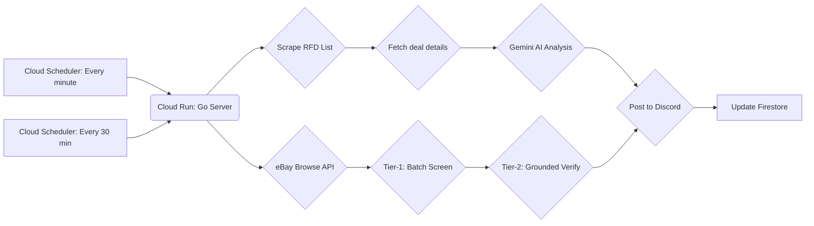

# RFD & eBay Deals Discord Bot

The ultimate companion for your Discord server to catch the hottest deals from RedFlagDeals and eBay Canada!

Adding this bot to your server will automatically post the latest and greatest deals directly into the channel of your choice. Never miss another price error or "Lava Hot" deal again.

> [!TIP]
> **Want to use the bot right away?**
> Click the link below to invite the bot to your server!
> 
> 👉 **[Invite the RFD Bot to Your Discord Server](https://discord.com/oauth2/authorize?client_id=1477501388673126460&permissions=18432&integration_type=0&scope=bot+applications.commands)**
>
> *(The bot only requests permission to Send Messages and Embed Links)*

---

## 🚀 How to Setup and Use

1. **Invite the bot:** Click the invite link above and select the server you want to add it to.
2. **Choose a channel:** Go to the channel where you want the bot to post deals.
3. **Run the setup command:** Type `/rfd-bot-setup set channel:#your-channel-name type:your-preference` and hit Enter!
   * The `type` option allows you to choose exactly what deals you want:
     * **RFD (RedFlagDeals):**
       *   `RFD: All deals` — Every deal posted
       *   `RFD: Tech only` — Tech category deals only
       *   `RFD: Warm + Hot (all categories)` — AI-selected best deals
       *   `RFD: Warm + Hot (tech only)` — AI-selected best tech deals
       *   `RFD: Hot only (all categories)` — Only the absolute best deals
       *   `RFD: Hot only (tech only)` — Only the absolute best tech deals
     * **eBay Canada:**
       *   `eBay: Warm + Hot deals` — AI-verified eBay deals from tracked sellers
       *   `eBay: Hot deals only` — Only the absolute best eBay deals
     * **All Sources (RFD + eBay):**
       *   `All Sources: Warm + Hot` — Best deals from all sources
       *   `All Sources: Hot only` — Only the absolute best deals from all sources
   * *Note: "Warm" and "Hot" deals are determined entirely by the Gemini AI's analysis. For RFD, this includes deal content and user comments. For eBay, a two-tier AI system first screens batches for promising deals, then individually verifies each candidate against current market prices using Google Search grounding.*

That's it! The bot will now monitor RedFlagDeals and tracked eBay sellers 24/7 and post beautifully formatted alerts directly to that channel based on your chosen type.

To stop the bot from posting or securely view active subscriptions, an administrator can simply type `/rfd-bot-setup remove` in any channel. This brings up an interactive message with delete buttons for each active channel. Clicking a button will instantly remove that channel's subscription and update the message to confirm the removal, ensuring a clean and responsive UX.

---

## 🌟 Features

*   **Identifies RFD Hot Deals:** Scrapes the latest deals from the Hot Deals forum natively (extensively supporting the modern card-based layout structure) with fallback support.
*   **Gemini AI Integration:** Uses Google Gemini AI with **Google Search Grounding** to:
    *   Clean up and summarize messy deal titles based on extracted deal details.
    *   Determine if a deal is "Lava Hot" (adds 🔥 emojis and escalates the Discord alert color to hot pink).
    *   *Note: Automatically handles 429 quota rate limits by dynamically upgrading to higher-tier models (e.g., from `gemini-2.5-flash-lite` to `gemini-2.5-pro`) and resetting at midnight Pacific Time to maintain 100% uptime. Features robust error handling with automatic retries for transient network errors and enforced JSON output for increased reliability.*
*   **Deep Scraping:** Extracts detailed deal content from individual deal pages, including descriptions, comments, and **categories** (which RFD recently moved to detail pages) for better AI context and filtering. Features multi-layered fallbacks (visible HTML `dt/dd` tags, JSON-LD `Product/Offer` schema, and list-level extraction) to ensure pricing and retailer accuracy even when page structures vary.
*   **Intelligent Link Cleaner:** Features a robust, rules-based URL cleaner that automatically strips unwanted tracking parameters (`cmp`, `ref`, `_trkparms`, etc.) from Amazon, BestBuy, and eBay links while preserving crucial identifiers like ASINs and Item IDs, before applying our own affiliate tags.
*   **Discord Bot Notifications:** Sends detailed notifications to multiple subscribed Discord servers, complete with native Discord timestamps, actual deal URLs, concise engagement metrics, and categorized emojis for improved visual clarity. Includes the **Retailer/Store name** directly in the footer for instant context, with support for extracting retailer names from both CSS badges and structured JSON-LD.
*   **Smart Deduplication:** Automatically detects when identical deals are posted in multiple forum threads by fuzzy matching titles and target URLs. It gracefully merges their engagement metrics, sorts the threads by popularity, and appends all tracking links into a single unified Discord alert.
*   **Live Updates:** Discord embed colors escalate to warm or hot strictly based on AI analysis. Embeds are dynamically patched to keep likes, comments, and views accurate for up to 1 hour after publication to respect Discord's rate limits on editing old messages.
*   **eBay Seller Monitoring:** Tracks Buy It Now listings from a curated list of 20+ eBay Canada sellers via the official eBay Browse API. Polls every 30 minutes, identifies new listings, and runs them through a two-tier AI pipeline:
    1.  **Tier 1 (Batch Screening):** Groups items into batches of 10, asks Gemini to identify the top ~30% most promising deals without grounding (fast, cheap).
    2.  **Tier 2 (Grounded Verification):** For each tier-1 candidate, performs an individual Gemini call with Google Search grounding to verify the price against current Canadian retail prices. Only warm/hot deals are stored and sent to Discord.
*   **Admin-Managed Seller List:** eBay sellers are stored in Firestore and seeded with defaults on first run. Sellers can be added/removed via Firestore console without redeploying.
*   **Zero-Config For Users:** Just invite, set the channel via a Slash Command, and enjoy the deals.

---

## 🛠️ For Developers & Self-Hosting

Want to host your own instance or modify the code? The bot operates with a simple, serverless architecture on Google Cloud:

The bot operates with a simple, serverless architecture on Google Cloud:

*   **Cloud Scheduler:** Triggers the bot every minute via an HTTP GET to `/`.
*   **Cloud Run:** Hosts the Go HTTP server. When triggered:
    1.  Scrapes the RFD Hot Deals list natively.
    2.  Checks Firestore and compares scraped deals with previously processed ones.
    3.  Fetches deep detail pages (descriptions, comments) for new or updated deals.
    4.  *(Optional)* Passes deep deal context to Gemini AI to generate a clean title and "hotness" rating.
    5.  Sends or updates formatted deal notifications to all subscribed Discord channels via the Bot Token API.
    6.  Updates Firestore state for deals and active message IDs.
*   **Discord API (Interactions):** Exposes an endpoint (`/discord/interactions`) to handle Slash Command setups and removals securely (via Ed25519 signature validation).
*   **Firestore:** Stores deal records and active server subscriptions (`guildID -> channelID`).


```mermaid
graph LR
    A[Cloud Scheduler: Every minute] --> B(Cloud Run: Go Server)
    B --> C{Scrape RFD List}
    C --> D{Fetch deal details}
    D --> E{Gemini AI Analysis}
    E --> F{Post to Discord}
    F --> G[Update Firestore]

    H[Cloud Scheduler: Every 30 min] --> B
    B --> I{eBay Browse API}
    I --> J{Tier-1: Batch Screen}
    J --> K{Tier-2: Grounded Verify}
    K --> F
```

## 🤖 GitHub Actions CI/CD

The repository includes a GitHub Action in `.github/workflows/deploy.yml` that automatically builds and deploys the bot to Cloud Run on every push to the `main` branch.

### Required GitHub Secrets

To use the automated deployment, you MUST add the following as **Repository Secrets** in your GitHub settings (**Settings > Secrets and variables > Actions > Secrets tab > New repository secret**). 

> [!IMPORTANT]
> Do NOT add these under the "Variables" tab. Secrets are encrypted and hidden, which is required for API keys and Service Account tokens.

*   `GCP_SA_KEY`: The **entire JSON content** of your Google Cloud Service Account key.
*   `GOOGLE_CLOUD_PROJECT`: Your Google Cloud Project ID (e.g., `may2025-01`).
*   `DISCORD_APP_ID`: Your Discord Application ID.
*   `DISCORD_BOT_TOKEN`: Your Discord Bot Token.
*   `DISCORD_PUBLIC_KEY`: Your Discord Public Key.
*   `GEMINI_API_KEY`: Your Google Gemini API key.
*   `EBAY_CLIENT_ID`: (Optional) Your eBay Developer App Client ID. If omitted, eBay features are disabled.
*   `EBAY_CLIENT_SECRET`: (Optional) Your eBay Developer App Client Secret.

> [!WARNING]
> If `GCP_SA_KEY` is missing or empty, the workflow will fail with an error like:
> `google-github-actions/auth failed with: the GitHub Action workflow must specify exactly one of "workload_identity_provider" or "credentials_json"!`

## Local Development

### Clone Repository

```bash
git clone https://your-repository-url/rfd-discord-bot.git
cd rfd-discord-bot
```
*(Replace `https://your-repository-url/rfd-discord-bot.git` with the actual URL of your repository)*

### Environment Setup (Go)

1.  **Install Go:** Download and install Go from the [official Go download page](https://golang.org/dl/).
2.  **Navigate to Directory:** Open your terminal and navigate to the cloned `rfd-discord-bot` directory.
    ```bash
    cd path/to/rfd-discord-bot
    ```
3.  **Install Dependencies:** Run the following command to download and install the necessary Go modules:
    ```bash
    go mod tidy
    ```

### Environment Variables for Local Testing

The application requires the following environment variables to run locally:

*   `GOOGLE_CLOUD_PROJECT`: Your Google Cloud Project ID.
*   `DISCORD_APP_ID`: The Discord Application ID (for Slash Command registration).
*   `DISCORD_PUBLIC_KEY`: The Discord Public Key (for Ed25519 Interaction signature validation).
*   `DISCORD_BOT_TOKEN`: The Discord Bot Token used for API authorization.
*   `GEMINI_API_KEY`: (Optional) Your Google Gemini API key. If omitted, AI features like grounded title cleaning and hotness rating are disabled.
*   `EBAY_CLIENT_ID`: (Optional) Your eBay Developer App Client ID. If omitted, eBay features are disabled.
*   `EBAY_CLIENT_SECRET`: (Optional) Your eBay Developer App Client Secret.
*   `PORT`: (Optional) The port the HTTP server should listen on. Defaults to 8080.

It's recommended to create a `.env` file in the project root to store these variables. This file is included in `.gitignore` to prevent accidental commits of sensitive information.

**Create `.env` file:**
```bash
# .env
export GOOGLE_CLOUD_PROJECT="your-gcp-project-id"
export DISCORD_APP_ID="your-discord-app-id"
export DISCORD_PUBLIC_KEY="your-discord-public-key"
export DISCORD_BOT_TOKEN="your-discord-bot-token"
export GEMINI_API_KEY="your-gemini-api-key"
export EBAY_CLIENT_ID="your-ebay-client-id"
export EBAY_CLIENT_SECRET="your-ebay-client-secret"
export PORT="8080"
```
Replace placeholder values with your real tokens from the Discord Developer Portal and Google Cloud.

**Load Environment Variables:**
The application now automatically loads environment variables from a `.env` file in the project root using `godotenv`. You no longer need to manually source the file. Simply create the `.env` file as described above and run the application.

If you still prefer to set them manually in your shell session:
```bash
export GOOGLE_CLOUD_PROJECT="your-gcp-project-id"
export DISCORD_APP_ID="your-discord-app-id"
export DISCORD_PUBLIC_KEY="your-discord-public-key"
export DISCORD_BOT_TOKEN="your-discord-bot-token"
export GEMINI_API_KEY="your-gemini-api-key"
```

### Running Locally

Once the environment variables are set, you can run the application using:
```bash
go run main.go
```
Or, if all your Go files are in the `main` package and in the root directory:
```bash
go run .
```
This will start an HTTP server, typically on port `8080` (or the port specified by the `PORT` environment variable, which Cloud Run sets automatically).

To test the handler locally, you can send a GET request to `http://localhost:8080/` (or the specific path your handler listens on, if different) using a tool like `curl` or your web browser.
```bash
curl http://localhost:8080/
```
Note: While you can trigger it via HTTP locally, in the deployed Google Cloud environment, the primary trigger is Cloud Scheduler.

### Running Tests

To run the standard unit tests:
```bash
go test ./...
```

To run the integration tests (which spin up a local mock server and test the full pipeline):
```bash
go test ./internal/processor/... -tags=integration -v
```

## Google Cloud Deployment (Detailed & Hand-holding)

These instructions will guide you through deploying the bot to Google Cloud Run.

### Prerequisites

1.  **Google Cloud Project:** You need an active Google Cloud Project. If you don't have one, create one at the [Google Cloud Console](https://console.cloud.google.com/).
2.  **`gcloud` CLI:** Install and initialize the Google Cloud CLI.
    *   Installation instructions: [Google Cloud SDK](https://cloud.google.com/sdk/docs/install)
    *   Authenticate and initialize `gcloud`:
        ```bash
        gcloud auth login
        gcloud init
        ```
        During `gcloud init`, you will be prompted to pick a project and can set a default region. This is the recommended first step.

    *   **Set Environment Variables for `gcloud` commands:**
        For convenience, and to avoid repeatedly typing your project ID and region, set the following environment variables in your shell. These will be used in subsequent `gcloud` commands.

        **For Linux/macOS (bash/zsh):**
        ```bash
        export PROJECT_ID=$(gcloud config get-value project)
        export REGION="us-central1" # Or your preferred region, e.g., us-east1, europe-west1
        echo "PROJECT_ID set to: $PROJECT_ID"
        echo "REGION set to: $REGION (Ensure this is a valid region for your services and that it supports Cloud Run, Firestore, and Cloud Scheduler)"
        ```

        **For Windows (Command Prompt):**
        ```bash
        for /f "tokens=*" %i in ('gcloud config get-value project') do set PROJECT_ID_VAL=%i
        set REGION_VAL=us-central1
        echo PROJECT_ID_VAL is set to: %PROJECT_ID_VAL%
        echo REGION_VAL is set to: %REGION_VAL% (Ensure this is a valid region for your services)
        ```
        Then use `%PROJECT_ID_VAL%` and `%REGION_VAL%` in the `gcloud` commands where indicated.

        **For Windows (PowerShell):**
        ```powershell
        $env:PROJECT_ID = $(gcloud config get-value project)
        $env:REGION = "us-central1" # Or your preferred region
        Write-Host "PROJECT_ID set to: $env:PROJECT_ID"
        Write-Host "REGION set to: $env:REGION (Ensure this is a valid region for your services)"
        ```
        Then use `$env:PROJECT_ID` and `$env:REGION` in the `gcloud` commands where indicated.

        **Note on Region Selection:**
        While `us-central1` is suggested as a common, cost-effective default, it's crucial to:
        1.  Verify that your chosen region supports all necessary services (Cloud Run, Firestore, Cloud Scheduler).
        2.  Consider factors like latency to your users or the source of data (e.g., RFD servers).
        3.  Check current pricing for services in that region.
        You can list available compute regions using `gcloud compute regions list`. The region for Firestore is chosen during its setup and should ideally match your Cloud Run and Cloud Scheduler region.

### Enable APIs

The bot requires several Google Cloud APIs to be enabled for your project:
*   Cloud Run API: For deploying and running the serverless application.
*   Cloud Firestore API: For database storage.
*   Cloud Scheduler API: For triggering the bot periodically.
*   Cloud Build API: For building container images when deploying from source.

Enable them using the following `gcloud` command:
```bash
# For Linux/macOS (ensure PROJECT_ID is set as shown above):
gcloud services enable run.googleapis.com firestore.googleapis.com cloudscheduler.googleapis.com cloudbuild.googleapis.com --project "$PROJECT_ID"

# For Windows CMD (ensure PROJECT_ID_VAL is set):
# gcloud services enable run.googleapis.com firestore.googleapis.com cloudscheduler.googleapis.com cloudbuild.googleapis.com --project "%PROJECT_ID_VAL%"

# For PowerShell (ensure $env:PROJECT_ID is set):
# gcloud services enable run.googleapis.com firestore.googleapis.com cloudscheduler.googleapis.com cloudbuild.googleapis.com --project "$env:PROJECT_ID"
```
Ensure you use the correct variable (`$PROJECT_ID`, `%PROJECT_ID_VAL%`, or `$env:PROJECT_ID`) based on your shell and the setup instructions above.

### Configure Cloud Build Service Account Permissions

When deploying to Cloud Run from source (using the `--source .` flag), Google Cloud Build is utilized to build your container image and push it to Artifact Registry. The Cloud Build service account requires specific IAM permissions to perform these actions. If these permissions are missing, the deployment will likely fail with a `PERMISSION_DENIED` error during the build process.

**1. Identify Your Project Number:**
You'll need your Google Cloud Project Number (distinct from the Project ID) to correctly identify the Cloud Build service account. You can retrieve it using the following command:
```bash
# For Linux/macOS:
gcloud projects describe "$PROJECT_ID" --format='value(projectNumber)'

# For Windows CMD:
# gcloud projects describe "%PROJECT_ID_VAL%" --format='value(projectNumber)'

# For PowerShell:
# gcloud projects describe "$env:PROJECT_ID" --format='value(projectNumber)'
```
Make a note of the outputted project number (e.g., `123456789012`), as you'll need it in the next step.

**2. Grant `roles/run.builder` to the Cloud Build Service Account:**
The Cloud Build service account, which typically has an email address like `YOUR_PROJECT_NUMBER@cloudbuild.gserviceaccount.com`, needs the `roles/run.builder` role on your project to successfully build and deploy to Cloud Run. Grant this role using the command below, ensuring you replace `YOUR_PROJECT_ID` and `YOUR_PROJECT_NUMBER` (the value obtained in the previous step):
```bash
# For Linux/macOS (replace YOUR_PROJECT_NUMBER with the value from the previous step):
gcloud projects add-iam-policy-binding "$PROJECT_ID" --member="serviceAccount:YOUR_PROJECT_NUMBER@cloudbuild.gserviceaccount.com" --role="roles/run.builder"

# For Windows CMD (replace YOUR_PROJECT_NUMBER):
# gcloud projects add-iam-policy-binding "%PROJECT_ID_VAL%" --member="serviceAccount:YOUR_PROJECT_NUMBER@cloudbuild.gserviceaccount.com" --role="roles/run.builder"

# For PowerShell (replace YOUR_PROJECT_NUMBER):
# gcloud projects add-iam-policy-binding "$env:PROJECT_ID" --member="serviceAccount:YOUR_PROJECT_NUMBER@cloudbuild.gserviceaccount.com" --role="roles/run.builder"
```
This step is crucial for deployments from source to succeed.

**Artifact Registry Note:**
Additionally, when deploying from source for the first time, `gcloud run deploy` might prompt you to enable the Artifact Registry API (`artifactregistry.googleapis.com`) and offer to create a default Docker repository (e.g., `cloud-run-source-deploy`) in your chosen region. You should allow these operations when prompted, as Artifact Registry is used to store the container images built by Cloud Build.

### Configure Google Cloud Build (project.toml)

Because the project places its `main` package inside the `cmd/server/` directory, you need to tell Google Cloud Build where to find the source code to build the container.

Create a file named `project.toml` in the project root with the following content:

```toml
[[build.env]]
  name = "GOOGLE_BUILDABLE"
  value = "./cmd/server"
```
Ensure this file is committed to your repository before attempting to deploy from source or connecting a GitHub repository for continuous deployment.
### Create Firestore Instance

To set up Firestore for the bot, follow these steps in the [Google Cloud Console](https://console.cloud.google.com/firestore):

1.  **Navigate to Firestore:** Go to the Firestore section of the Google Cloud Console.
2.  **Create Database:** If you don't have a Firestore database in your project, click **"Create Database"**.
3.  **Select Database ID:**
    *   You'll be prompted to name your database (Database ID).
    *   **Recommendation:** Use the default ID, which is typically `(default)`.
    *   *Justification:* The application code ([`firestore_client.go`](firestore_client.go:1)) is configured to use the default database and does not specify a custom ID.
4.  **Choose Edition:**
    *   Select the **"Standard"** edition.
    *   *Justification:* This edition is cost-effective for applications with minimal data and low-frequency operations, suitable for this bot.
5.  **Select Mode:**
    *   Choose **"Native Mode"**.
    *   *Justification:* This is required by the Go client library used in the application and aligns with existing project documentation.
6.  **Set Up Security Rules:**
    *   You will be asked to configure security rules.
    *   **Recommendation:** Start with **Restrictive rules** (e.g., the default option that denies all client access).
    *   *Justification:* The bot accesses Firestore using server-side authentication (IAM roles for the Cloud Run service account), not client-side SDKs, so client access can be denied for better security.
7.  **Choose Location Type:**
    *   Select **"Region"** for the location type.
    *   *Justification:* A regional location offers lower latency and cost compared to multi-region, and is suitable when your Cloud Run service is deployed to a specific region.
8.  **Select Region:**
    *   Choose a specific **region** (e.g., `us-central1`, `europe-west1`).
    *   **Recommendation:** Select the same region where you plan to deploy your Cloud Run service.
    *   *Justification:* Co-locating Firestore and your Cloud Run service minimizes network latency and potential egress costs. This choice is permanent.
9.  **Finalize Creation:** Click **"Create Database"**.

The bot will automatically create the necessary collections (`deals`, `subscriptions`, `ebay_sellers`, `ebay_items`) within Firestore. The `ebay_sellers` collection is automatically seeded with the default seller list on first run if empty.

### eBay API Setup (Optional)

To enable eBay deal monitoring, you need an eBay Developer account with Production API keys:

1.  **Create an eBay Developer account:** Go to [developer.ebay.com](https://developer.ebay.com) and sign up.
2.  **Create an Application:** In the eBay Developer Portal, create a new application to get your Production keys.
3.  **Get your credentials:** Copy the **Client ID** (App ID) and **Client Secret** (Cert ID) from the Production keyset.
4.  **Add to your `.env` file:**
    ```bash
    EBAY_CLIENT_ID=your-production-client-id
    EBAY_CLIENT_SECRET=your-production-client-secret
    ```
5.  **Sync to GitHub Secrets:** Run the secret sync script to push them to your repository:
    ```powershell
    .\scripts\sync_secrets.ps1
    ```

If the eBay credentials are not set (or set to placeholder values), the bot will start normally with eBay features disabled. You can add real keys later without any code changes.

> [!NOTE]
> The eBay Browse API has a free tier of 5,000 calls/day. With 21 sellers batched into a single query, polling every 30 minutes uses ~50 calls/day — well within limits.

**Cloud Scheduler for eBay (Optional):** Once you have eBay credentials configured and deployed, create a second Cloud Scheduler job to trigger eBay processing:
```bash
# For Linux/macOS:
gcloud scheduler jobs create http ebay-deal-trigger --location "$REGION" --schedule "*/30 * * * *" --uri YOUR_CLOUD_RUN_SERVICE_URL/process-ebay --http-method GET --time-zone "America/Toronto" --description "Triggers eBay deal processing every 30 minutes" --project "$PROJECT_ID"
```
You can adjust the schedule to be more or less frequent (the API rate limits can easily handle every 15 minutes).

### Configure Environment Variables for Deployment

The `DISCORD_APP_ID`, `DISCORD_PUBLIC_KEY`, `DISCORD_BOT_TOKEN`, and `GEMINI_API_KEY` are sensitive pieces of information and should be passed to the Cloud Run service as environment variables during deployment.

**CRITICAL: DO NOT COMMIT ACTUAL SECRETS TO YOUR CODE REPOSITORY.**

You will provide these values in the deployment command below.

### Deploy Cloud Run Service

Navigate to your project's root directory (`rfd-discord-bot`) in your terminal. Run the following command to deploy the service:

```bash
# For Linux/macOS (ensure PROJECT_ID and REGION are set):
gcloud run deploy rfd-discord-bot --source . --platform managed --region "$REGION" --allow-unauthenticated --set-env-vars GOOGLE_CLOUD_PROJECT=$PROJECT_ID,DISCORD_APP_ID=YOUR_APP_ID,DISCORD_PUBLIC_KEY=YOUR_PUBLIC_KEY,DISCORD_BOT_TOKEN=YOUR_BOT_TOKEN,GEMINI_API_KEY=YOUR_GEMINI_API_KEY --project "$PROJECT_ID"
```

**Explanation of variables and placeholders:**
*   `$REGION`: This should be the Google Cloud region you set up earlier (e.g., `us-central1`). It's used for the `--region` flag.
*   `$PROJECT_ID`: This is your Google Cloud Project ID, set up earlier.
*   `YOUR_APP_ID`, `YOUR_PUBLIC_KEY`, `YOUR_BOT_TOKEN`: Replace with your actual Discord API strings.
*   `YOUR_GEMINI_API_KEY`: Replace with your actual Google Gemini API key. If you omit it, AI processing will be gracefully disabled.

After the deployment is successful, the command will output the **Service URL**. Copy this URL, as you'll need it for setting up Cloud Scheduler.

### Set up Cloud Scheduler

Cloud Scheduler will periodically trigger your Cloud Run service to check for new deals.

You can create a Cloud Scheduler job via the GCP Console or using `gcloud`.

**Using `gcloud` (Recommended):**
```bash
# For Linux/macOS (ensure PROJECT_ID and REGION are set, replace YOUR_CLOUD_RUN_SERVICE_URL):
gcloud scheduler jobs create http rfd-bot-trigger --location "$REGION" --schedule "* * * * *" --uri YOUR_CLOUD_RUN_SERVICE_URL --http-method GET --time-zone "America/Toronto" --description "Triggers the RFD Discord Bot every minute" --project "$PROJECT_ID"

# For Windows CMD (ensure PROJECT_ID_VAL and REGION_VAL are set, replace YOUR_CLOUD_RUN_SERVICE_URL):
# gcloud scheduler jobs create http rfd-bot-trigger --location "%REGION_VAL%" --schedule "* * * * *" --uri YOUR_CLOUD_RUN_SERVICE_URL --http-method GET --time-zone "America/Toronto" --description "Triggers the RFD Discord Bot every minute" --project "%PROJECT_ID_VAL%"

# For PowerShell (ensure $env:PROJECT_ID and $env:REGION are set, replace YOUR_CLOUD_RUN_SERVICE_URL):
# gcloud scheduler jobs create http rfd-bot-trigger --location "$env:REGION" --schedule "* * * * *" --uri YOUR_CLOUD_RUN_SERVICE_URL --http-method GET --time-zone "America/Toronto" --description "Triggers the RFD Discord Bot every minute" --project "$env:PROJECT_ID"
```

**Explanation of variables and placeholders:**
*   `rfd-bot-trigger`: A descriptive name for your Cloud Scheduler job.
*   `--location "$REGION"`: Specifies the region for the Cloud Scheduler job. **This MUST be the same region where your Cloud Run service is deployed.**
*   `--schedule "* * * * *"`: Cron syntax for running the job every minute. Adjust as needed (e.g., `/2 * * * *` for every two minutes, be polite).
*   `--uri YOUR_CLOUD_RUN_SERVICE_URL`: **Replace this placeholder with the actual Service URL** outputted by the `gcloud run deploy` command.
*   `--http-method GET`: The HTTP method used to invoke your Cloud Run service.
*   `--time-zone "America/Toronto"`: Sets the timezone for interpreting the schedule. Adjust to your local timezone if preferred.
*   `--project "$PROJECT_ID"`: Specifies the project for the scheduler job.

**Using GCP Console:**
1.  Go to [Cloud Scheduler](https://console.cloud.google.com/cloudscheduler) in the GCP Console.
2.  Click **"Create Job"**.
3.  Configure the job:
    *   **Name:** e.g., `rfd-bot-trigger`
    *   **Region:** Choose a region for the scheduler job.
    *   **Description:** (Optional) e.g., "Triggers RFD Discord Bot"
    *   **Frequency:** Enter the cron schedule (e.g., `*/5 * * * *` for every 5 minutes).
    *   **Timezone:** Select your timezone (e.g., `America/Toronto`).
    *   **Target type:** HTTP
    *   **URL:** Paste the Cloud Run **Service URL**.
    *   **HTTP Method:** GET (or POST, depending on your handler; GET is fine here).
    *   **Auth header:** Select "None" (because we used `--allow-unauthenticated` for Cloud Run). If you deployed a private service, you'd configure OIDC or OAuth here.
4.  Click **"Create"**.

### Configure IAM Permissions

Proper IAM permissions ensure your Cloud services can interact securely.

**1. Cloud Run Service Account to Firestore:**
The Cloud Run service needs permission to read from and write to Firestore.
*   **Find Service Account:** When you deploy a Cloud Run service, it uses a service account. By default, this is the Compute Engine default service account (`PROJECT_NUMBER-compute@developer.gserviceaccount.com`). You can see the exact service account used in the Cloud Run service details page in the GCP Console, under the "Security" or "Details" tab.
*   **Grant Role:** Grant this service account the "Cloud Datastore User" role (which includes Firestore permissions) or the more specific "Firestore User" (`roles/firestore.user`) role.

```bash
# For Linux/macOS (replace YOUR_CLOUD_RUN_SERVICE_ACCOUNT_EMAIL with the actual email):
gcloud projects add-iam-policy-binding "$PROJECT_ID" --member="serviceAccount:YOUR_CLOUD_RUN_SERVICE_ACCOUNT_EMAIL" --role="roles/datastore.user"

# For Windows CMD (replace YOUR_CLOUD_RUN_SERVICE_ACCOUNT_EMAIL):
# gcloud projects add-iam-policy-binding "%PROJECT_ID_VAL%" --member="serviceAccount:YOUR_CLOUD_RUN_SERVICE_ACCOUNT_EMAIL" --role="roles/datastore.user"

# For PowerShell (replace YOUR_CLOUD_RUN_SERVICE_ACCOUNT_EMAIL):
# gcloud projects add-iam-policy-binding "$env:PROJECT_ID" --member="serviceAccount:YOUR_CLOUD_RUN_SERVICE_ACCOUNT_EMAIL" --role="roles/datastore.user"
```
Replace `YOUR_CLOUD_RUN_SERVICE_ACCOUNT_EMAIL` with the email of the service account your Cloud Run service uses. This is often `PROJECT_NUMBER-compute@developer.gserviceaccount.com` by default, or a custom one if you configured it. You can find it in the Cloud Run service details in the GCP Console.

**2. Cloud Scheduler Service Account to Invoke Cloud Run:**
*   If you used `--allow-unauthenticated` when deploying your Cloud Run service, this step is **generally not needed** for the invocation itself, as the service is public.
*   However, if you deploy your Cloud Run service as private (by omitting `--allow-unauthenticated`), the Cloud Scheduler service account needs permission to invoke it.
*   Cloud Scheduler jobs run under a service account. By default, this is the App Engine default service account (`YOUR_PROJECT_ID@appspot.gserviceaccount.com`). If you use a custom service account for Scheduler, ensure it has the "Cloud Run Invoker" (`roles/run.invoker`) role for your Cloud Run service.

For a private service, the command would look like:
```bash
# Example for a private service - not strictly needed if --allow-unauthenticated was used
# For Linux/macOS (replace YOUR_SCHEDULER_SERVICE_ACCOUNT_EMAIL):
gcloud run services add-iam-policy-binding rfd-discord-bot --member="serviceAccount:YOUR_SCHEDULER_SERVICE_ACCOUNT_EMAIL" --role="roles/run.invoker" --region="$REGION" --platform=managed --project="$PROJECT_ID"

# For Windows CMD (replace YOUR_SCHEDULER_SERVICE_ACCOUNT_EMAIL):
# gcloud run services add-iam-policy-binding rfd-discord-bot --member="serviceAccount:YOUR_SCHEDULER_SERVICE_ACCOUNT_EMAIL" --role="roles/run.invoker" --region="%REGION_VAL%" --platform=managed --project="%PROJECT_ID_VAL%"

# For PowerShell (replace YOUR_SCHEDULER_SERVICE_ACCOUNT_EMAIL):
# gcloud run services add-iam-policy-binding rfd-discord-bot --member="serviceAccount:YOUR_SCHEDULER_SERVICE_ACCOUNT_EMAIL" --role="roles/run.invoker" --region="$env:REGION" --platform=managed --project="$env:PROJECT_ID"
```
Replace `YOUR_SCHEDULER_SERVICE_ACCOUNT_EMAIL` with the service account Cloud Scheduler uses (often `YOUR_PROJECT_ID@appspot.gserviceaccount.com` by default). This step is only necessary if you deployed Cloud Run as a private service (without `--allow-unauthenticated`).

## Usage

Once deployed and Cloud Scheduler is active (it might take a minute for the first scheduled run after creation), the bot runs automatically. New deals from the RFD Hot Deals feed will be processed and posted to your configured Discord channel.

## Error Logging & Alerting

### Cloud Logging

All standard output from your Go application when running on Cloud Run is automatically captured by [Google Cloud Logging](https://console.cloud.google.com/logs/viewer). 

**Structured Logging (`slog`)**: When deployed to Cloud Run, the application automatically switches to structured JSON logging using a custom `internal/logger` package. This maps Go `slog` levels (Debug, Info, Notice, Warning, Error, Critical, Alert, Emergency) to their proper Google Cloud Logging severity counterparts. It also supports dynamic log-level filtering via the `LOG_LEVEL` environment variable (e.g. `LOG_LEVEL=DEBUG`). This is highly beneficial for both GCP log filtering and the Gemini AI integration, as it logs the full AI input prompt and raw output cleanly inside the JSON payload.

To view logs:
1.  Go to the GCP Console.
2.  Navigate to "Logging" > "Logs Explorer".
3.  You can filter logs by your Cloud Run service name:
    *   In the query builder, select "Cloud Run Revision" as the resource type.
    *   Then select your service name (`rfd-discord-bot`) and revision.
4.  **To view AI Decisions**: Search for `jsonPayload.msg="Completed Gemini AI Deal Analysis"`. You can expand the log entry to see `prompt`, `clean_title`, and `is_lava_hot` fields nicely formatted.

This is the primary place to check for errors or operational messages from your bot.

### Critical Alerts (How to Set Up)

For proactive monitoring, you can set up alerts in [Google Cloud Monitoring](https://console.cloud.google.com/monitoring) for critical errors.

1.  **Navigate to Alerting:** In the GCP Console, go to "Monitoring" > "Alerting".
2.  **Create Log-Based Metrics (Optional but Recommended for Specific Errors):**
    *   Go to "Logging" > "Log-based Metrics".
    *   Click "Create Metric".
    *   Define a filter for specific error messages you want to track (e.g., `resource.type="cloud_run_revision" AND resource.labels.service_name="rfd-discord-bot" AND severity=ERROR AND textPayload:"Failed to fetch feed"`).
    *   Give the metric a name (e.g., `rfd-bot-fetch-errors`).
3.  **Create an Alert Policy:**
    *   In "Monitoring" > "Alerting", click "+ Create Policy".
    *   **Add Condition:**
        *   Select the metric you want to alert on. This could be a general error count for your Cloud Run service or a specific log-based metric you created.
        *   For example, to alert on any error logs from your service:
            *   Target: `Cloud Run Revision` > `Log Entries`
            *   Filter for your service and `severity=ERROR`.
            *   Configure the condition (e.g., "Alert if count of error logs > 0 in 5 minutes").
        *   If using a log-based metric:
            *   Target: Search for your custom log-based metric name.
            *   Configure the condition (e.g., "Alert if value of metric > 0 for 5 minutes").
    *   **Notifications:**
        *   Choose or create notification channels (e.g., Email, SMS, PagerDuty, Slack via Pub/Sub).
    *   **Name and Save:** Give your alert policy a descriptive name.

**Specific Error Types to Consider Alerting On:**
*   Persistent "Failed to fetch RFD feed" errors.
*   "Discord webhook failed" errors (could indicate an invalid URL or Discord API issues).
*   "Firestore operation error" (read/write failures).
*   Any unhandled panics or critical errors logged by the application.

Cloud Logging automatically manages log retention according to configured policies.

## Troubleshooting

### Common Issues

*   **Deals Not Appearing in Discord:**
    1.  **Check Cloud Scheduler:** Go to Cloud Scheduler in the GCP Console. Verify the job (`rfd-bot-trigger`) status. Look at "Last run" and "Result". If it's failing, check its logs.
    2.  **Check Cloud Run Logs:** Go to Cloud Logging and filter for your `rfd-discord-bot` service. Look for any errors related to the RFD site, Firestore operations, or sending messages to Discord.
    3.  **Discord Config:** Ensure the `DISCORD_APP_ID`, `DISCORD_PUBLIC_KEY`, and `DISCORD_BOT_TOKEN` environment variables are correctly populated. If deals don't flow to a server, verify the server admin ran `/rfd-bot-setup set`.
    4.  **Firestore Data:** Check Firestore `subscriptions` and `deals` collections to verify logic flows.

*   **Authentication/Permission Errors in Logs:**
    1.  **Cloud Run to Firestore:** Double-check that the Cloud Run service's service account has the "Cloud Datastore User" (or "Firestore User") role.
    2.  **Cloud Scheduler to Cloud Run (for private services):** If your service is private, ensure the Scheduler's service account has "Cloud Run Invoker" permission. (Not applicable if `--allow-unauthenticated` was used).

*   **Incorrect Environment Variables:**
    *   Verify `GOOGLE_CLOUD_PROJECT` is correctly set in the Cloud Run service's environment variables (check the "Revisions" tab of your service in Cloud Run, select the active revision, and look at "Variables").

### How to Diagnose

---

This README provides a comprehensive guide for developers to understand, set up, deploy, and manage the Multi-Server RFD Hot Deals Discord Bot on Google Cloud.

## Secrets Management

To securely and automatically synchronize your local `.env` secrets to GitHub Action repository secrets, you can use the provided PowerShell script.

### Prerequisites

1. **GitHub CLI (`gh`)**: Install using `winget install --id GitHub.cli` or from [cli.github.com](https://cli.github.com/).
2. **Authentication**: Run `gh auth login` to authenticate with your GitHub account.

### Synchronizing Secrets

Run the following command from the root of the repository:

```powershell
.\scripts\sync_secrets.ps1
```

The script will:
1. Read key-value pairs from your `.env` file.
2. Handle multiline secrets (like `GCP_SA_KEY`) correctly.
3. Upload each secret to your GitHub repository using the official GitHub CLI.
